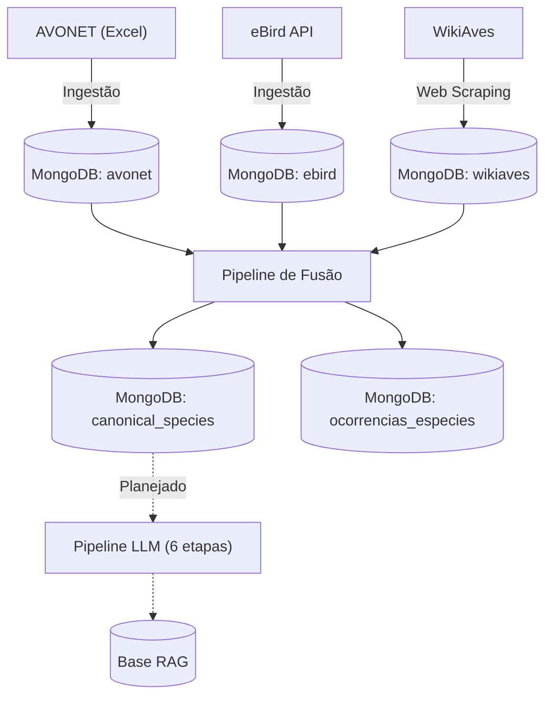

# 🦜 AvesRAG Dataset Builder

Pipeline de dados para a construção de um dataset ornitológico de aves brasileiras. O projeto tem como objetivo alimentar um sistema RAG (Retrieval-Augmented Generation) focado na identificação e conhecimento de espécies de aves.

## Sobre o Projeto

O AvesRAG Dataset Builder é um pipeline ETL (Extract, Transform, Load) desenhado para ingerir dados de três fontes principais:

- **AVONET**: Características morfológicas globais das aves (BirdLife International).
- **eBird API**: Dados de ocorrência geográfica por município brasileiro (Cornell Lab of Ornithology).
- **WikiAves**: Descrições textuais e metadados das espécies via web scraping.

O sistema consolida e funde essas informações em documentos canônicos de espécies armazenados no MongoDB, construindo uma base de conhecimento rica e unificada, preparada para um sistema RAG focado em identificação de aves brasileiras.

## Arquitetura

A arquitetura baseia-se na ingestão de dados brutos que são armazenados em coleções no MongoDB. Em seguida, os dados passam por um processo de fusão que gera os documentos finais. O sistema também prevê um pipeline futuro de enriquecimento semântico utilizando LLMs (6 etapas — documentado em `docs/dev/arquitetura_prompts.md`).



## Stack Tecnológica

| Tecnologia | Uso |
|---|---|
| **Python 3.13** | Linguagem principal |
| **Poetry** | Gerenciamento de dependências |
| **MongoDB 7.0** | Banco de dados (via Docker) |
| **Docker Compose** | Infraestrutura local |
| **Playwright** | Web scraping (renderização JS) |
| **BeautifulSoup4** | Parsing HTML |
| **pandas** | Manipulação de dados tabulares |
| **RapidFuzz** | Matching fuzzy de nomes de municípios |
| **tqdm** | Barras de progresso |

## Estrutura do Projeto

```text
avesrag-dataset-builder/
├── scr/
│   ├── core/          # Configuração e modelos de domínio
│   ├── database/      # Conexões MongoDB e PostGIS
│   ├── ingestion/     # Pipelines ETL (AVONET, eBird, WikiAves)
│   └── fusion/        # Fusão de dados e geração de documentos canônicos
├── data/
│   ├── raw/           # Dados brutos (Excel, CSV, JSON)
│   └── treat/         # Dados tratados (JSON)
├── docs/
│   ├── dev/           # Documentação de arquitetura e especificações
│   ├── articles/      # Artigos de referência (PDFs)
│   └── morfologia/    # Taxonomias controladas (JSON)
├── prompts/           # Templates de prompts LLM (em construção)
├── docker-compose.yml # MongoDB 7.0 + Mongo Express
├── pyproject.toml     # Dependências Poetry
└── .env.example       # Template de variáveis de ambiente
```

## Pré-requisitos

- Python 3.13+
- [Poetry](https://python-poetry.org/docs/#installation)
- Docker e Docker Compose
- Chave de API do [eBird](https://ebird.org/api/keygen)

## Instalação e Configuração

```bash
# 1. Clone o repositório
git clone https://github.com/rafaelladuarte/avesrag-dataset-builder.git
cd avesrag-dataset-builder

# 2. Instale as dependências
poetry install

# 3. Instale o navegador para scraping
poetry run playwright install chromium

# 4. Configure as variáveis de ambiente
cp .env.example .env
# Edite .env com suas credenciais (ver tabela abaixo)

# 5. Inicie o banco de dados
docker compose up -d
```

## Execução das Pipelines

A ordem de execução garante a integridade e o encadeamento dos dados:

| Etapa | Comando | Descrição |
|---|---|---|
| 1 | `poetry run python -m scr.ingestion.wikiaves_especies` | Scraping da lista de espécies WikiAves |
| 2 | `poetry run python -m scr.ingestion.wikiaves_info` | Scraping detalhado de cada espécie |
| 3 | `poetry run python -m scr.ingestion.avonet` | Ingestão dados morfológicos AVONET |
| 4 | `poetry run python -m scr.ingestion.ebird` | Ingestão ocorrências via eBird API |
| 5 | `poetry run python -m scr.fusion.species_occurrence` | Agregação de ocorrências por espécie |
| 6 | `poetry run python -m scr.fusion.canonical_specie` | Fusão final → documentos canônicos |

## Variáveis de Ambiente

| Variável | Descrição | Obrigatório |
|---|---|---|
| `MONGO_INITDB_ROOT_USERNAME` | Usuário root do MongoDB | Sim |
| `MONGO_INITDB_ROOT_PASSWORD` | Senha root do MongoDB | Sim |
| `MONGO_EXPRESS_USERNAME` | Usuário do Mongo Express (interface web) | Não |
| `MONGO_EXPRESS_PASSWORD` | Senha do Mongo Express | Não |
| `MONGODB_URI` | URI de conexão MongoDB | Sim |
| `POSTGRES_URI` | URI de conexão PostGIS | Sim |
| `EBIRD_API_KEY` | Chave de API do eBird | Sim |
| `MAX_ESPECIES` | Limite de espécies no scraping WikiAves (0 = sem limite) | Não |

## Fontes de Dados

- **[AVONET](https://doi.org/10.1111/ele.13898)** (BirdLife International) — Banco de dados global com traços morfológicos e ecológicos de aves.
- **[eBird](https://ebird.org/)** (Cornell Lab of Ornithology) — Maior plataforma de observação de aves do mundo; fonte das ocorrências geográficas.
- **[WikiAves](https://www.wikiaves.com.br/)** — Enciclopédia colaborativa de aves do Brasil; fonte de descrições textuais e metadados.
- **[CBRO/Zenodo](https://zenodo.org/)** — Lista Oficial de Aves do Brasil do Comitê Brasileiro de Registros Ornitológicos.
- **[IBGE](https://www.ibge.gov.br/)** — Malha territorial e biomas predominantes por município.

## Documentação

Documentação detalhada de arquitetura disponível em `docs/dev/`:

- [`arquitetura_mongodb.md`](docs/dev/arquitetura_mongodb.md) — Estrutura das collections e princípios de engenharia de dados
- [`arquitetura_prompts.md`](docs/dev/arquitetura_prompts.md) — Pipeline DAG de enriquecimento semântico via LLMs
- [`map_fonts.md`](docs/dev/map_fonts.md) — Mapeamento campo-a-campo das fontes de dados

## Licença

A ser definida.
